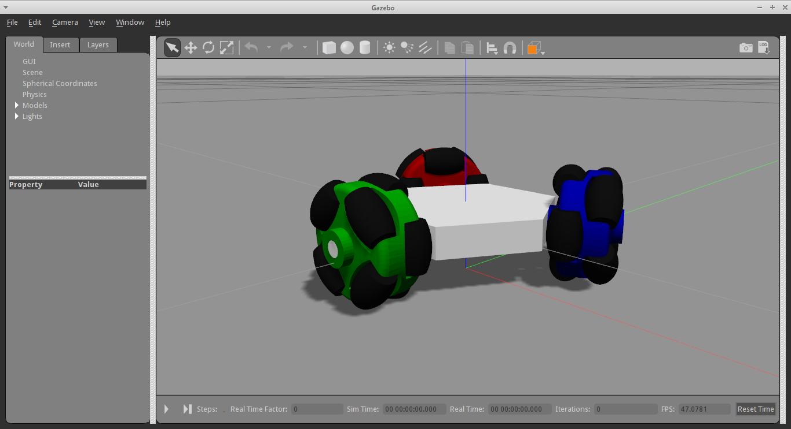

<<<<<<< HEAD
# ubxtranslator [](https://travis-ci.org/dalymople/ubxtranslator)

## Overview
This module provides a simple way to decode messages from uBlox GPS devices in the UBX format. 
Like the high accuracy NEO-M8U module that I have created, 
<a href="https://www.tindie.com/products/dalymople/gps-dead-reckoning-board-neo-m8u-gnss">click here for more info.</a><br>
<br>
This package has no dependencies! This is written in pure python using only the standard lib and supports any
standard byte stream. The predefined messages are not added to the parser by default, this allows
you to have tight control over what messages can be parsed.

Is this the fastest implementation of a UBX parser? Probably not. If speed is critical then you 
probably need to go write something in C. If you want something that is fast enough
and easy to use, you are in the right place. Keep reading.

Supports Python 3.5 and up.


## Quickstart

Install the package with pip<br>
`pip install ubxtranslator`

Import the core module<br>
`from ubxtranslator import core`

If the message class you want has already been defined simply import it. 
If not you will need to construct the messages and classes yourself, see the examples for more information.<br>
`from ubxtranslator import predefined`

Construct the parser<br>
```
parser = core.Parser([
  predefined.CLS_ACK, 
  predefined.CLS_NAV
])
```

Then you can use the parser to decode messages from any byte stream.<br>
`cls_name, msg_name, payload = parser.receive_from(port)`

The payload is the named tuple of the message<br>
`print(cls_name, msg_name, payload.lat, payload.lng)`

## Examples
For full examples see the examples directory. 

## TODO's
Want to contribute? Please feel free to submit issues or pull requests. 
Nothing in this package is very complicated, please have a crack and help me to improve this.

- Add the ability to pack messages into packets for two way communications
- Add repeated blocks
- Add more and better tests
- Add Field type RU1_3
- Add async support
=======
# OpenBase



An omnidirectional mobile platform, with a 3 omnidirectional wheels layout, with two objectives: to facilitate the development of mobile robot control algorithms and to facilitate the development of mobile robots in general by providing a ready to use movement solution.

It is free and open source, licensed with the MIT/Expat license, with the intent of powering the research of robotics anywhere for anyone.

It’s provided with tutorials and the code is commented and modularized, to facilitate the work with it as much as possible.

It is the result of my final graduation work in Computer Engineering and, as such, it has a lot of scientific research behind it. I could make it available here too, but it's in Portuguese, and i would have to translate about 50 pages to English, so it will not come in the near future.

The idea was to make a physical model, also with all the necessary instructions, but the hardware didn’t arrive in time, so only the simulation part for validation has been developed.

It uses the Gazebo simulator, so you need to know how to use it first. I recommend [1] and [2] and skimming over [3] is good.

It’s also a good idea to at least superficially understand the kinematics. The works of [4] and [5] are very good starting points and are freely available online.

This is an image I created that should contain all necessary geometric constraints to derive the kinematics equations:


Remember that V1, V2 and V3 are also called, V_left, V_back and V_right, respectively. These are the forward kinematics equations relative to the robot's reference frame:


If you need forward kinematics relative to the world's frame, transform the result of the last equations with the following ones:


For the inverse kinematics, you can start with the velocities relative to the robot's frame, or you can convert the velocities relative to the world's frame with the following equations:


Then, you can use the following equations for the inverse kinematics relative to the robot's frame:


Given the purpose of this work, I may improve it in the future with more advanced features like a dynamic model instead of a kinematic model or better movement control, but since this is an open project, please do contact me (or use the available GitHub funcionalities) to improve this work so everyone can have an even better experience, specially if it’s a bug fix or a correction in the text of the tutorials.

The "model" folder contains the model of an omnidirectional wheel (38MM DOUBLE PLASTIC OMNI WHEEL) and the model of a robot made out of an abstract body and these wheels for the sake of validation. The models are Gazebo readable: just drop them in Gazebo's default model folder and you'll be able to add them to any Gazebo world through the GUI.

The "plugin" folder contains the source code of the control plugin I developed, and a demo plugin that makes the robot execute some random movements for testing. It needs to be compiled because the plugin compiled in a system might not work on another.

The "tutorial" folder contain several tutorials that need to be read so this project can be used. Start with the one called "getting started".

The "world" folder contains a Gazebo world that simply contains the default ground plane and the aforementioned abstract robot model in the center of this world.

References

[1] http://gazebosim.org/tutorials?cat=guided_b&tut=guided_b1

[2] http://gazebosim.org/tutorials?tut=plugins_hello_world&cat=write_plugin

[3] http://gazebosim.org/tutorials?cat=guided_i&tut=guided_i1

[4] J. Borenstein et. al., “Sensors for Dead Reckoning”, in “Where am I?” Sensors and Methods for Mobile Robot Positioning, Ann Arbor: Univ. of Michigan, 1998, ch. 1, sec. 1.3.5, pp. 25–26.

[5] J. Gonçalves et. al., “REAL TIME TRACKING OF AN OMNIDIRECTIONAL ROBOT - An Extended Kalman Filter Approach”, in ICINCO 2008, PROCEEDINGS OF THE FIFTH INTERNATIONAL CONFERENCE ON INFORMATICS IN CONTROL, AUTOMATION AND ROBOTICS, ROBOTICS AND AUTOMATION 2, FUNCHAL, MADEIRA, PORTUGAL, MAY 11-15, 2008, Funchal, Madeira, 2008, p.5–10.
>>>>>>> df370bb03920981132d3482bb30656ce1c98d3da
